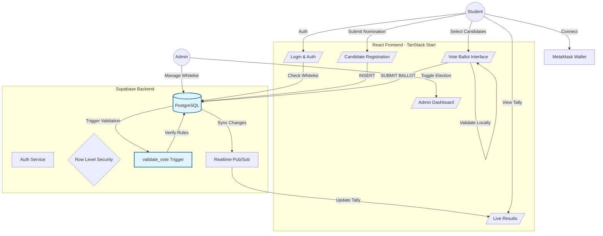

# VOTE·IT System Architecture

This flowchart illustrates the architecture and data flow of the VOTE·IT election system.

```mermaid
graph TD
    %% Actors
    Admin((Admin))
    Student((Student))
    Wallet[MetaMask Wallet]

    %% Frontend Routes
    subgraph Frontend [React Frontend - TanStack Start]
        Login[/Login & Auth/]
        AdminPanel[/Admin Dashboard/]
        VotePage[/Vote Ballot Interface/]
        Results[/Live Results/]
        Reg[/Candidate Registration/]
    end

    %% Backend/Infrastructure
    subgraph Supabase [Supabase Backend]
        Auth[Auth Service]
        RLS{Row Level Security}
        DB[(PostgreSQL)]
        Triggers[validate_vote Trigger]
        Realtime[Realtime Pub/Sub]
    end

    %% Interactions
    Admin -->|Toggle Election| AdminPanel
    Admin -->|Manage Whitelist| DB
    
    Student -->|Connect| Wallet
    Student -->|Auth| Login
    Login -->|Check Whitelist| DB
    
    Student -->|Submit Nomination| Reg
    Reg -->|INSERT| DB
    
    Student -->|Select Candidates| VotePage
    VotePage -->|Validate Locally| VotePage
    VotePage -->|SUBMIT BALLOT| DB
    
    DB -->|Trigger Validation| Triggers
    Triggers -->|Verify Rules| DB
    
    DB -->|Sync Changes| Realtime
    Realtime -->|Update Tally| Results
    Student -->|View Tally| Results

    %% Styling
    classDef primary fill:#f9f,stroke:#333,stroke-width:2px;
    classDef logic fill:#e1f5fe,stroke:#01579b,stroke-width:2px;
    class DB,Triggers logic;
```
